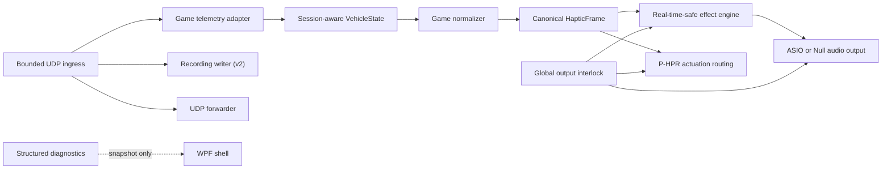

# Haptic Drive ASIO Architecture

This document describes the current architecture, not the historical stage-by-stage journey. Historical architecture notes are archived in [docs/archive/ARCHITECTURE_STAGE_HISTORY.md](/C:/Users/ethan/OneDrive/Documents/ASIO%20Haptic%20Engine%20Program/docs/archive/ARCHITECTURE_STAGE_HISTORY.md).

## Scope

Haptic Drive ASIO is a Windows/.NET 8/WPF application for low-latency sim-racing haptics.

Current production scope:

- F1 25 is the only implemented game integration.
- BST-1 / bass-shaker output is the primary audio path.
- Simagic P-HPR remains a separate non-audio actuation path.
- Hardware-absent development is a first-class mode.

Non-goals for the current build:

- claiming physical shaker tuning or safe gain as finished,
- claiming production WASAPI streaming,
- adding real P-HPR USB automation without explicit owner approval,
- coupling future game support to F1-specific enums or packet structs.

## System flow

## Core boundaries

### Telemetry ingress

- UDP receive is bounded and backpressure-aware.
- Live haptic processing, forwarding, and recording each use separate bounded queues.
- Raw UDP payload bytes are preserved byte-for-byte for recording, replay, and forwarding.
- Loopback is the default bind mode. LAN telemetry is explicit opt-in.

### Game integration boundary

- Game-specific parsing lives behind `IGameTelemetryAdapter`.
- `IGameIntegrationRegistry` owns the available integrations and defaults.
- The active production registration is F1 25 (`f1-25`, protocol `F1 25 UDP`, version `v3`).

### Shared state boundary

- Parser/adaptor output is `VehicleState`.
- `VehicleState` is session-aware and uses stamped packet timing plus frame identity.
- Per-signal freshness is evaluated through `VehicleStateFreshness`.

### Canonical haptic boundary

- `IVehicleStateNormalizer` turns `VehicleState` into a canonical `HapticFrame`.
- `canonical HapticFrame` is the cross-game contract for effect and actuation logic.
- Effects and actuation routes should not depend on raw F1 packet IDs, raw F1 surface IDs, or F1-only enums on the live path.

`HapticFrame` currently carries:

- identity,
- canonical telemetry signals,
- canonical driving context,
- freshness per signal.

### Effect boundary

- Effects register through `IHapticEffectRegistry`.
- Each effect has:
  - a stable key,
  - parameter descriptors,
  - required-signal declarations,
  - validation,
  - runtime factory.
- Profiles persist effect settings as schema-v2 keyed documents.

### Output boundary

- Audio output is abstracted behind the audio device/runtime layers.
- `NullAudioOutputDevice` remains the default safe output.
- ASIO is the intended production hardware path.
- WASAPI debug output remains manual/experimental only and is not treated as a production streaming path.

### Actuation boundary

- P-HPR is intentionally separate from ASIO and `IAudioOutputDevice`.
- Actuation consumes canonical `HapticFrame` plus `ActuationDrivingContext`.
- Real USB writes remain explicitly gated and must not run in automated tests.

## Safety model

The global output interlock is the top-level safety authority.

- It starts latched by default.
- It can trip for startup-safe default, emergency mute, stale telemetry, device faults, invalid configuration, manual-test blocking, and shutdown.
- When latched, audio output, manual test output, and actuation routes all suppress output.
- Shutdown trips the interlock before device stop/dispose.

Related ADRs:

- [ADR-0001 global output interlock](/C:/Users/ethan/OneDrive/Documents/ASIO%20Haptic%20Engine%20Program/docs/adr/ADR-0001-global-output-interlock.md)
- [ADR-0002 canonical haptic frame](/C:/Users/ethan/OneDrive/Documents/ASIO%20Haptic%20Engine%20Program/docs/adr/ADR-0002-canonical-haptic-frame.md)

## Real-time rules

The steady-state render/callback path must remain:

- allocation-free after warmup,
- free of UI work,
- free of disk IO,
- free of logging and string formatting,
- free of blocking network or telemetry work.

Diagnostics on the hot path are limited to atomic counters and immutable snapshot publication.

## Recording and replay

- New recordings use the resilient v2 format.
- Raw packets are stored unchanged.
- Truncated recordings recover up to the first invalid record and remain marked incomplete.
- Replay uses absolute packet deadlines to avoid cumulative drift.

See [docs/RECORDING_AND_REPLAY.md](/C:/Users/ethan/OneDrive/Documents/ASIO%20Haptic%20Engine%20Program/docs/RECORDING_AND_REPLAY.md).

## UI shell responsibilities

The WPF shell is responsible for:

- composition,
- page hosting,
- event entry points,
- visible status presentation,
- non-real-time orchestration.

Controllers and view models now own focused publication responsibilities for:

- safety state,
- telemetry status,
- output status,
- effect tuning,
- recording/replay status,
- P-HPR status,
- diagnostics summaries.

## Extension points

### Adding a new game

Add:

1. a new parser/adaptor implementing `IGameTelemetryAdapter`,
2. a `GameIntegrationDescriptor`,
3. a normalizer implementing `IVehicleStateNormalizer`,
4. tests proving `VehicleState -> HapticFrame` behavior.

Effects should continue consuming canonical `HapticFrame`, not game-specific packet types.

### Adding a new effect

Add:

1. a descriptor,
2. a runtime,
3. profile defaults/validation,
4. tests.

See [docs/HOW_TO_ADD_A_HAPTIC_EFFECT.md](/C:/Users/ethan/OneDrive/Documents/ASIO%20Haptic%20Engine%20Program/docs/HOW_TO_ADD_A_HAPTIC_EFFECT.md).

## Document map

- Current architecture: this file
- Active issues only: [KNOWN_ISSUES.md](/C:/Users/ethan/OneDrive/Documents/ASIO%20Haptic%20Engine%20Program/KNOWN_ISSUES.md)
- Future work: [ROADMAP.md](/C:/Users/ethan/OneDrive/Documents/ASIO%20Haptic%20Engine%20Program/ROADMAP.md)
- Chronological implementation history: [DEVELOPMENT_LOG.md](/C:/Users/ethan/OneDrive/Documents/ASIO%20Haptic%20Engine%20Program/DEVELOPMENT_LOG.md)
- Historical stage-detail archive: [docs/archive/README.md](/C:/Users/ethan/OneDrive/Documents/ASIO%20Haptic%20Engine%20Program/docs/archive/README.md)
